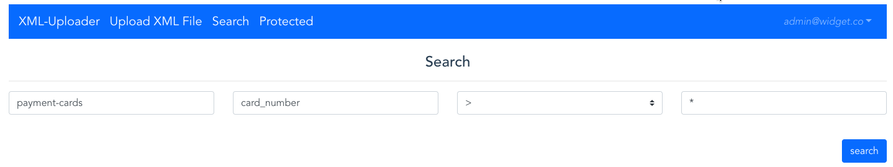

## Exploit based on IAM Permission Flaw

##### Step 1:
* Open browser

##### Step 2:
* open `http://sls-training-ui.s3-website-us-east-1.amazonaws.com/` for the XML-Uploder application.

##### Step 3:
* Click on `Search` icon to search for information.

##### Step 4:
* In the search parameter, enter required fields and search.

##### Step 5:
* You can able see all the information in the database.

