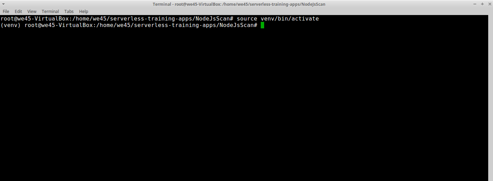
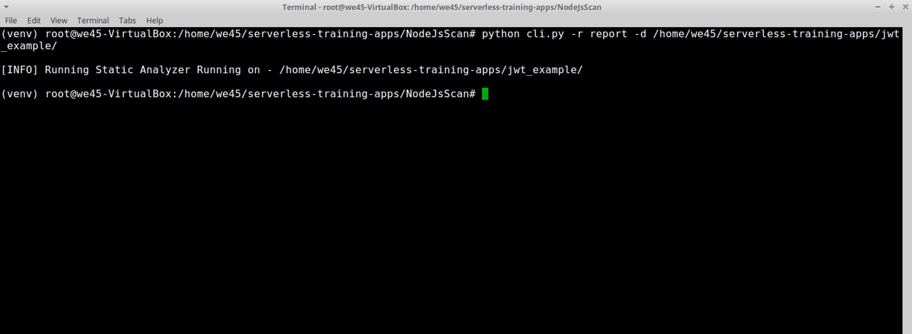
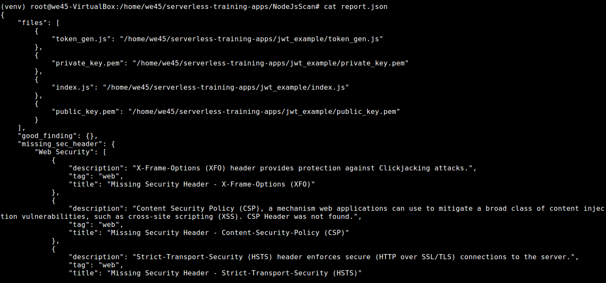

# **`NodeJsScan - NodeJS Static-Application-Security-Testing`**

Step 1: Navigate to the NodeJsScan directory(`/home/we45/serverless-training-apps/NodeJsScan`)

Step 2: Activate python-virtual environment by running `source venv/bin/activate`

Step 3: Run the scan against a directory containing NodeJS code and generate a `json` report by running `python cli.py -r report -d /home/we45/serverless-training-apps/jwt_example/`

Step 4: The report is generated and can be read

