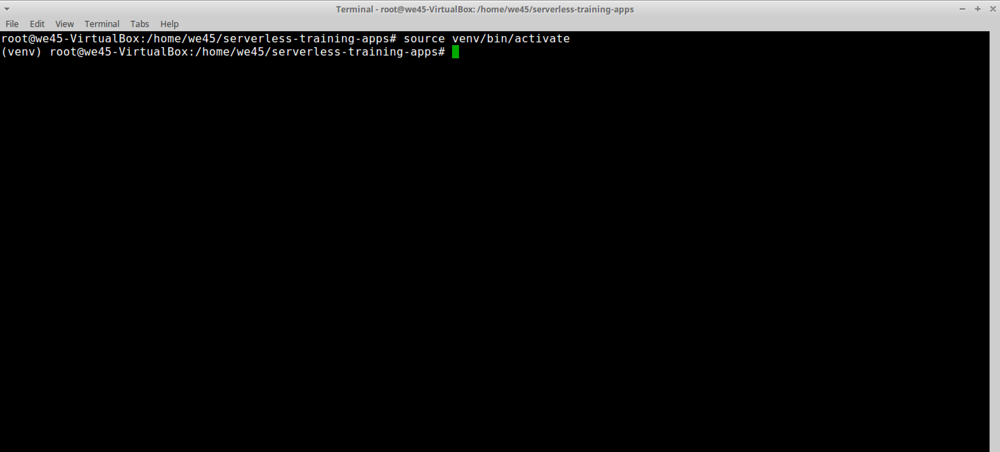
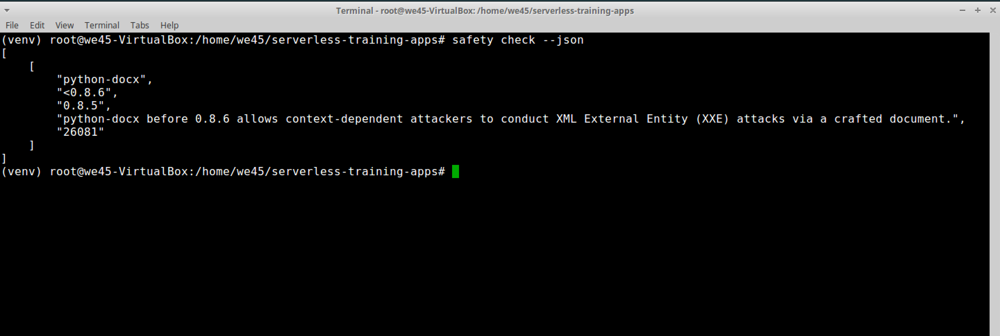

# **`Safety - Python Source-Code-Analysis-Tool`**

Step 1: Navigate to the directory(`/home/we45/serverless-training-apps`) that has the python virtual-environment.

Step 2: Activate python-virtual environment by running `source venv/bin/activate`

Step 3: Install the necessary requirements

Step 4: Run a scan on installed python libraries by running `safety check --json`

