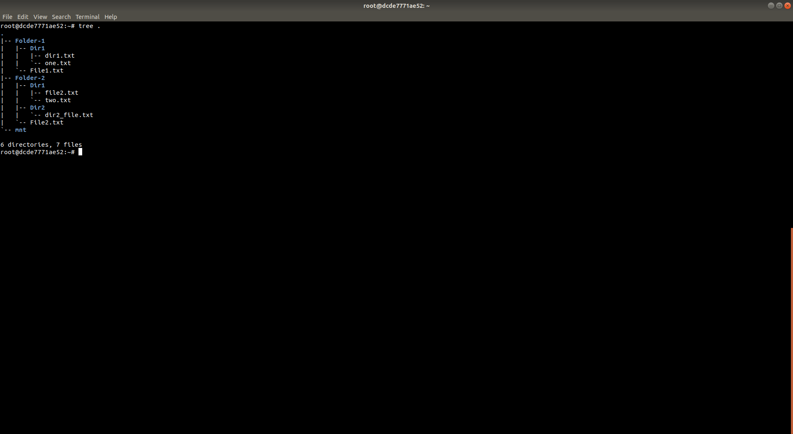

# Union Mount FileSystem

---

               ** Please Note: This might not work on VM

Step 1: Create Three Folders named `Folder-1`,  `Folder-2` and `mnt`

Step 2: Create sub-directories and files in `Folder-1` and `Folder-2`

        
Step 3: Check the structure of directories that have been created

        
Step 4: Run `unionfs-fuse -o dirs=Folder-1:Folder-2  mnt/` . The directories and files in `Folder-1` and `Folder-2` will be mounted on `mnt`

        

Step 5: Check the structure of `mnt/` 

        
Step 6: To unmount, run `umount -l /path/to/mnt`

