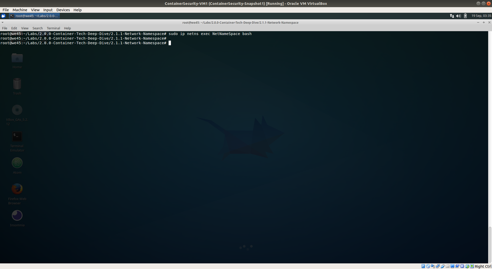

# Network Namespace

---

Step 1: Run `ifconfig -a` to get the list of network interfaces on the machine.

Step 2: To add a Networking Namespace, run `ip netns add NetNameSpace` and then run `ip netns list` to get the list of Network Namespaces

        
        
Step 3: Run `sudo ip netns exec NetNameSpace bash` to exec into the Network Namespace.

        
        
Step 4: Run `ifconfig -a` to get the list of network interfaces on the 'NetNameSpace' Network Namespace.
        

                
Step 5: Run `route -n` and `iptables -L` to verify that there is no routing or iptables available, since this is a new networking stack.

        
Step 6: Run `exit` to exit from the Network Namespace and `ip netns list` to verify.

        
Step 7: To delete the Network Namespce, run `sudo ip netns del NetNameSpace`

