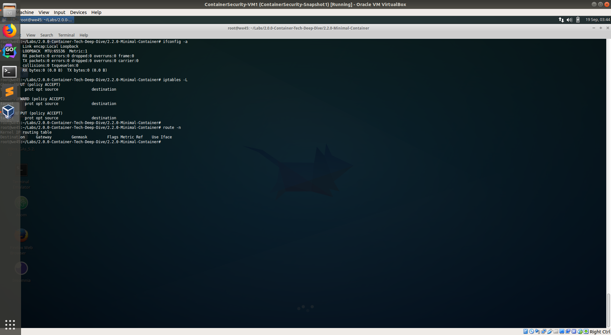
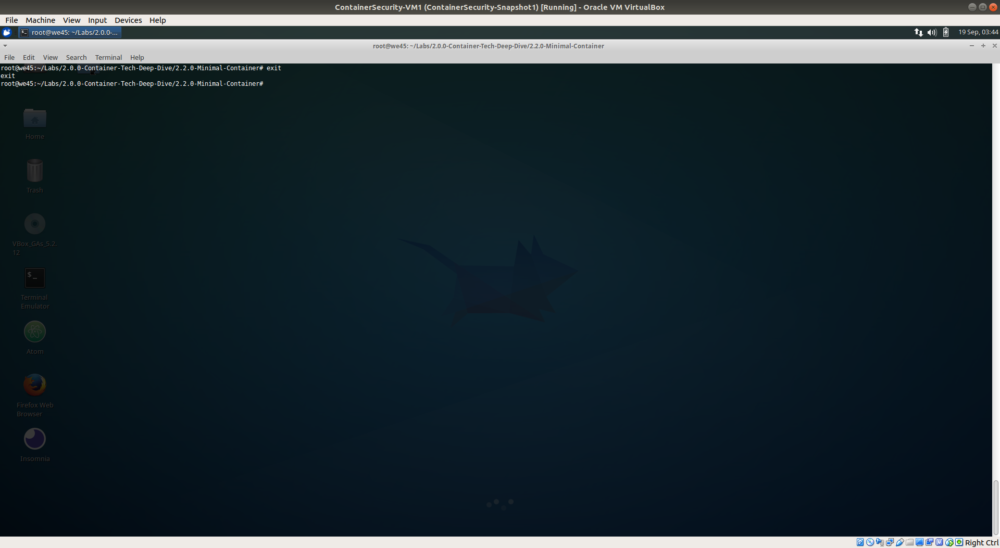

# Setting up a minimal container

---

Step 1: Run `ifconfig -a`, `iptables -L`, `route -L`, etc.. to get the list of network interfaces on the machine.

Step 2: To create a minimal container, run `unshare --net --ipc --uts --mount /bin/bash`        
        
        * Namespace flags used:
            --net : Unshare the network namespace
            --ipc : Unshare the Inter-Process-Communication namespace
            --uts : Unshare UTS namespace
            --mount : Unshare the Mount namespace

Step 3: Run  `ifconfig -a`, `iptables -L`, `route -n`, etc.. on the container to confirm

        
Step 4: Exit once done.

