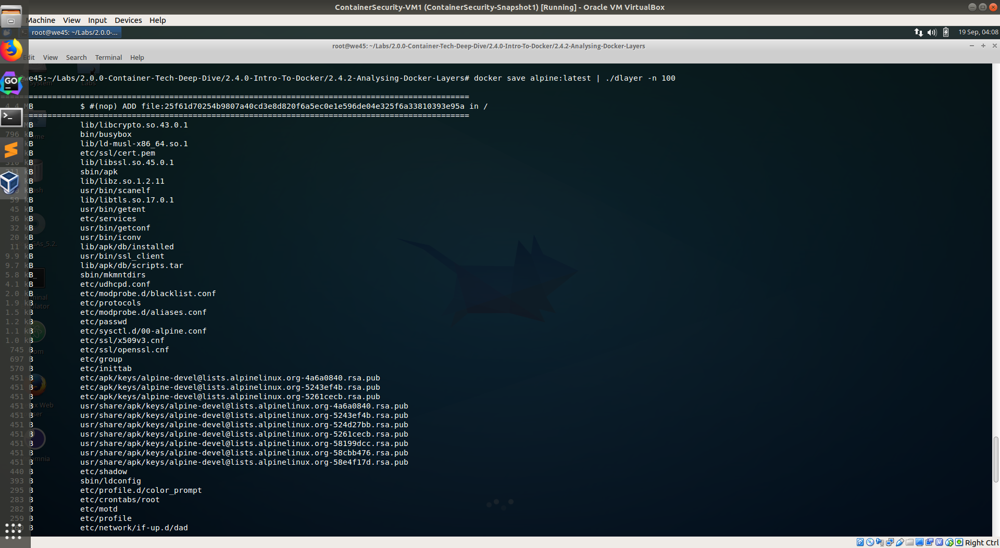

# Analysing Docker layers with Dlayer

---

Step 1: Run `docker images` to get list of images on the machine
        

        
        
Step 2: Select an image to be analysed and run `docker save alpine:latest | ./dlayer -n 100 | less` 

        

