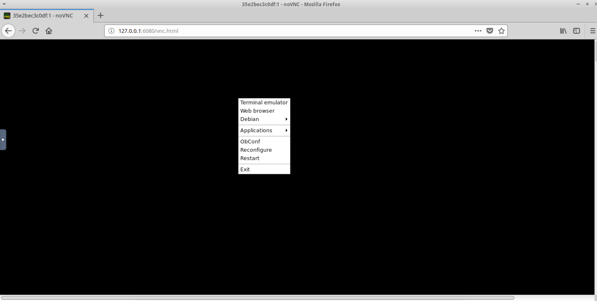

# **`Docker Daemon Configuration`**

Step 1: Run an nmap scan on the VM to get the list of ports that are open. `nmap 127.0.0.1 -sV -p 4243`

Step 2: To check access to the docker API, access `http://localhost:4243/version` and `http://localhost:4243/images/json`
 

Step 3: Activate the python virtual environment and run the script that will run a malicious container via. the docker API.

Step 4: On the browser, access the port mentioned in the script. `http://127.0.0.1:6080/vnc.html`

Step 5: `Right-Click` and open the terminal. The user has UI access to the Host machine. 

Step 6: To fix this issue, open `/etc/default/docker` and comment `DOCKER_OPTS`

