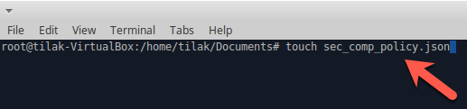
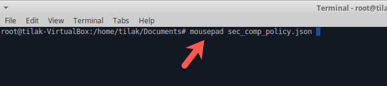
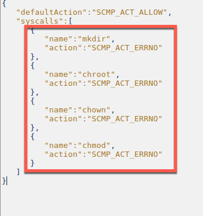

#Seccomp (secure computing mode) 

---

* Open terminal

* Create "sec_comp_policy.json" file 

* Open "sec_comp_policy.json" file

* Create a policy (commands shouldn't allow "example:mkdir (create folder)" ) 

 

* Once saved the configuration run docker using ("docker run -d --security-opt seccomp:sec_comp_policy.json -p 5050:5050 abhaybhargav/vul_flask")

* Exec into docker container ("docker exec -it container-id bash")

* Try create folder using ("mkdir demo")

* You will get an permission denied error

