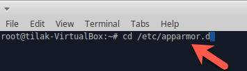

##AppArmor (Application Armor) 

* Open terminal

* Type "cd" into "/etc/apparmor.d"

* Type mkdir containers (create containers folder)

* Type "cd /etc/apparmor.d/containers"

* Create apparmor config file (touch docker_app_armor_config)

* Open "docker_app_armor_config" file (mousepad docker_app_armor_config)

* Enter configuration details (in this case we have disabled the passwd file view and write permission)

* Load file into a kernel using ("apparmor_parser -r -W /etc/apparmor.d/containers/docker_app_armor_config")

* Run docker using apparmor policy ("docker run --security-opt apparmor:docker_app_armor_config -d -p 5050:5050 abhaybhargav/vul_flask")

* Exec into docker container ("docker exec -it container-id bash")

* Type "cat /etc/passwd"

* You will get an permission denied error

