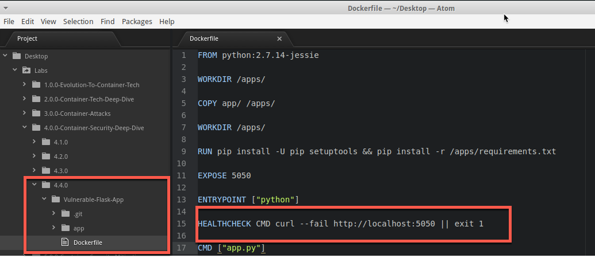
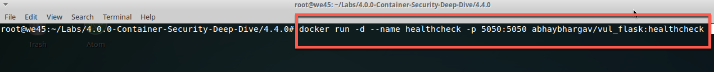

#HealthCheck

--- 

* Open Atom Editor
    
    

* Go to 4.0.0-Container-Security-Deep-Dive --> 4.4.0  --> Vulnerable-Flask-App
    -- > Open Dockerfile --> Insert the command before CMD ---> Save
    * `HEALTHCHECK CMD curl --fail http://localhost:5050 || exit 1`
    
    
    
* Open terminal

* cd  into the Lab Excise directory
    * `Labs/4.0.0-Container-Security-Deep-Dive/4.4.0/Vulnerable-Flask-App`
    
    
    
  
* Build docker using updated Dockerfile
    * `docker build -t abhaybhargav/vul_flask:healthcheck .`
    
    
    
* Run a docker container
    * `docker run -d --name healthcheck -p 5050:5050 abhaybhargav/vul_flask:healthcheck`
    
    
    
 * Inspect a running container
    * `docker inspect --format='{{json . State.Health}}' healthcheck`
    
