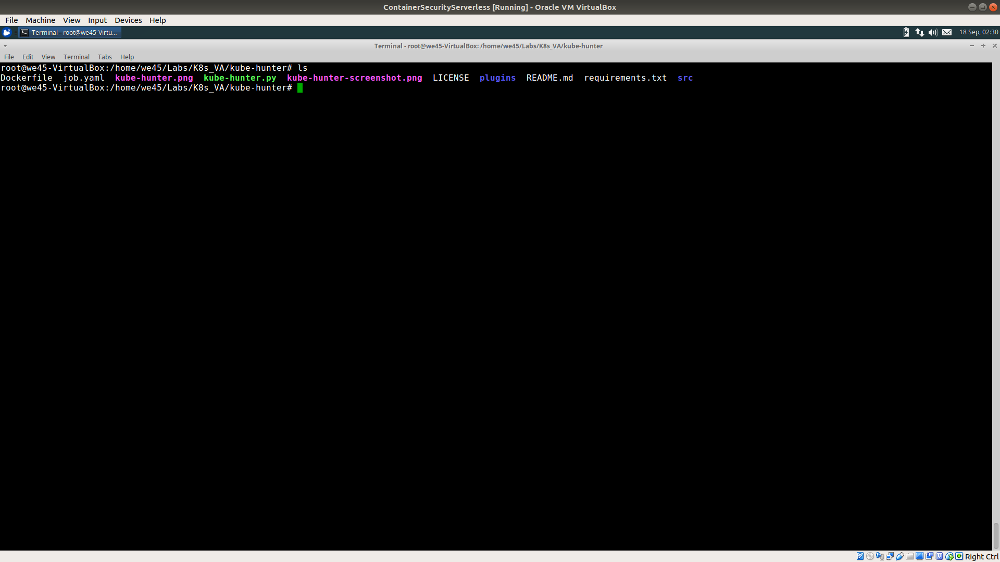
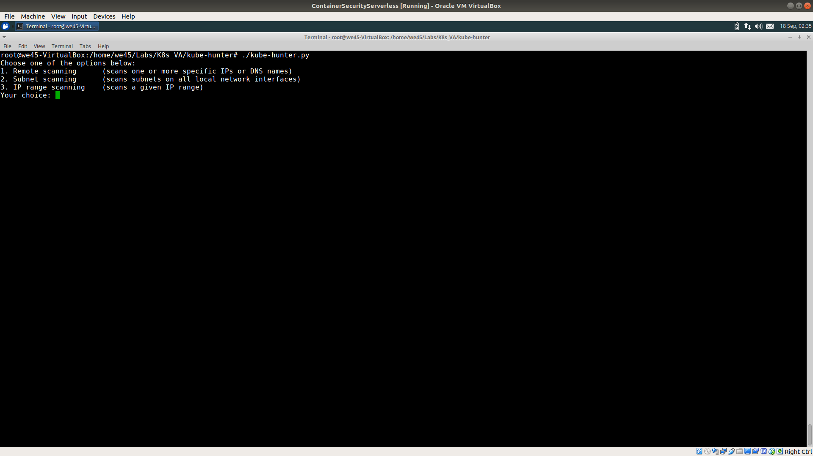
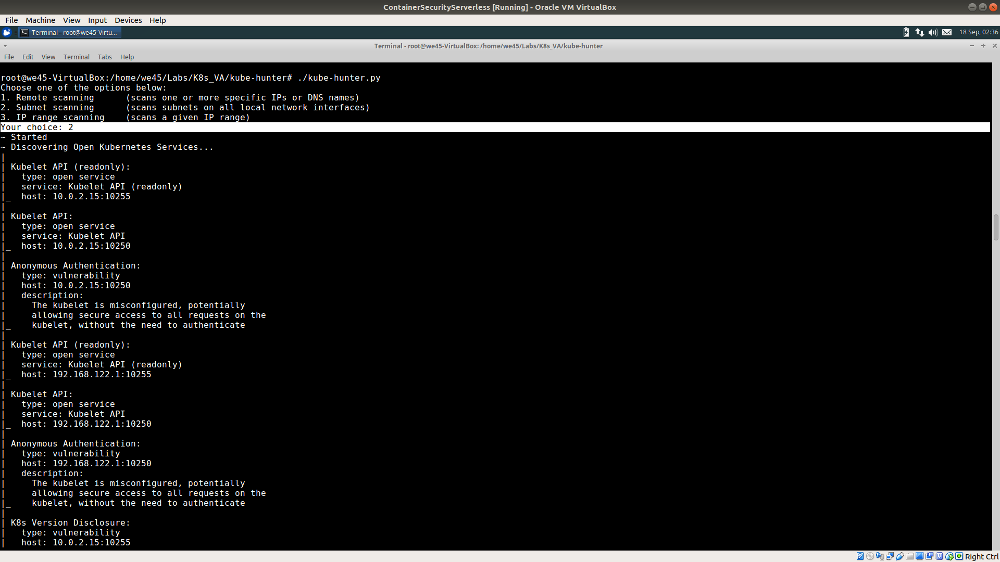

# **`Scanning K8s Cluster - Kubehunter`**

Step 1: Navigate to the directory that has `kubehunter.py` file

Step 2: Run `./kube-hunter.py --help` to get list of optional arguments available

Step 3: To get list of all passive and active scans, run `./kube-hunter.py --active --list`

    

Step 4: To start a kube-hunter passive scan, run `./kube-hunter.py`

Step 5: Select `option 2` to run a scan on the minikube instance deployed on the VM

    
