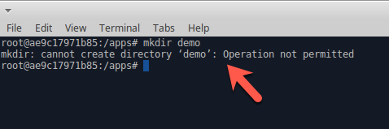

## Seccomp (secure computing mode) 

##### Step 1:

* Open Terminal

	

##### Step 2:

*  **cd** into  `Labs/4.0.0-Container-Security-Deep-Dive/4.2.0`

    ```commandline
    cd Labs/4.0.0-Container-Security-Deep-Dive/4.2.0
    ```

##### Step 3:

* Run `touch sec_comp_policy.json` create seccomp file

    ```commandline
    root@we45:~/Labs/4.0.0-Container-Security-Deep-Dive/4.2.0# touch sec_comp_policy.json
    ```

##### Step 4:

* Run `atom .` to launch the atom IDE

    ```commandline
    root@we45:~/Labs/4.0.0-Container-Security-Deep-Dive/4.2.0# atom .
    ```

##### Step 5:

* Create a policy (commands shouldn't allow "example:mkdir (create folder)" ) save.

    ```json
    {
      "defaultAction": "SCMP_ACT_ALLOW",
      "syscalls":[
        {
          "name":"mkdir",
          "action":"SCMP_ACT_ERRNO"
        },
        {
          "name":"chroot",
          "action":"SCMP_ACT_ERRNO"
        },
        {
          "name":"chown",
          "action":"SCMP_ACT_ERRNO"
        },
        {
          "name":"chmod",
          "action":"SCMP_ACT_ERRNO"
        }
      ]
    }
    ```

##### Step 6:

* Once saved the configuration run docker using `docker run -d --name=seccomp --security-opt seccomp:sec_comp_policy.json alpine`

    ```commandline
    root@we45:~/Labs/4.0.0-Container-Security-Deep-Dive/4.2.0# docker run -d --security-opt seccomp:sec_comp_policy.json -p 5050:5050 abhaybhargav/vul_flask
    4509ec89cdd062725c8c0f454452e4abfc1f67cd6be2f8880148123c36c1182c
    ```

##### Step 6:

* Exec into docker container ("docker exec -it container-id bash")


* Try create folder using ("mkdir demo")


* You will get an permission denied error




