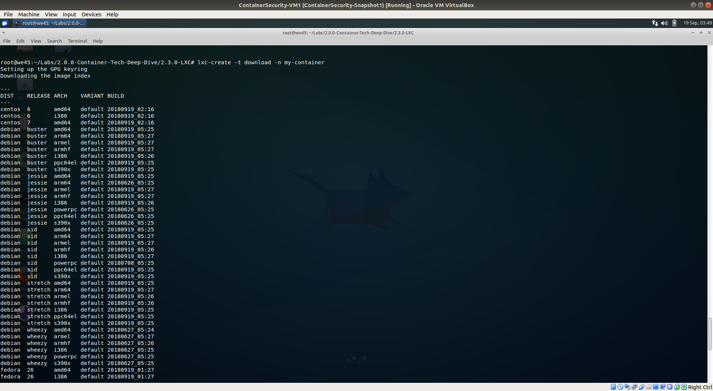
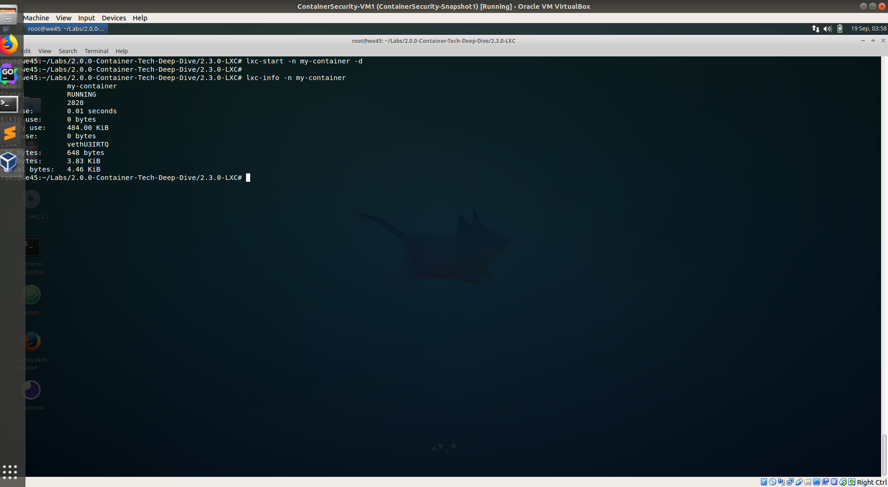
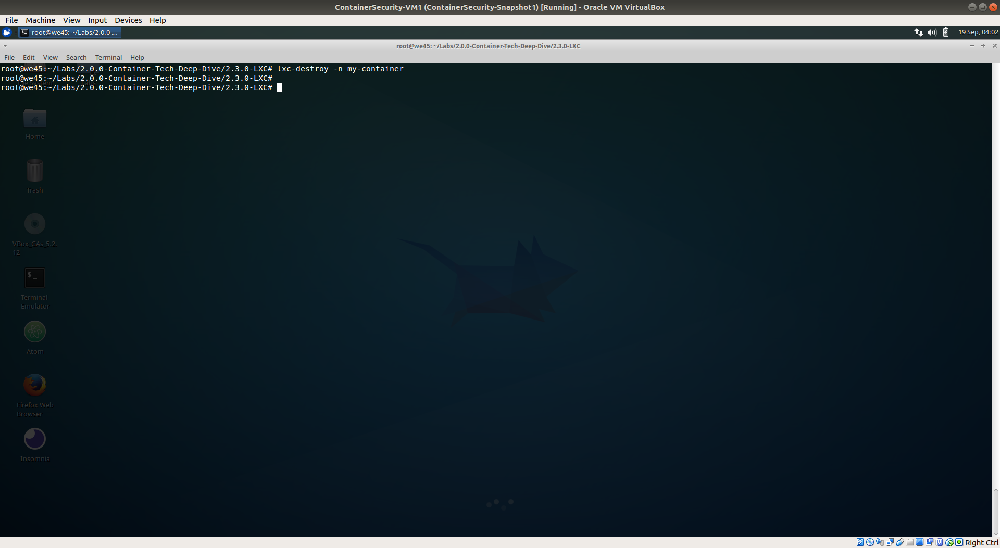

## LXC

Step 1: To create your first LXC container, run `lxc-create -t download -n my-container`

    
Step 2: The download template (`-t` flag in the command above) will give you options to select distribution, version, architecture. Select ubuntu, xenial and amd64 respectively.

    
Step 3: Once the download is complete, you can start the container by running `lxc-start -n my-container -d`. To confirm status of the container, run `lxc-info -n my-container`

Step 4: To get shell access to the container, run `lxc-attach -n my-container`.

    
Step 5: Commands like `ifconfig -a`, `lsb_release -a`, etc.. can be run inside the container.

    
Step 6: To exit from the container, run `exit`. Stop the container by running `lxc-stop -n my-container` 

    
Step 7: To remove and destroy the container, run `lxc-destroy -n my-container`

