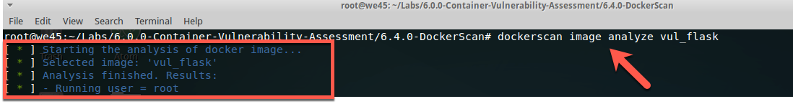

# DockerScan

---

##### Step1:

* Open terminal

##### Step2:

* cd into Path
    * `cd Labs/6.0.0-Container-Vulnerability-Assessment/6.4.0-DockerScan`

    

##### Step3:

* Select Docker image and save into a same directory
    * `docker save abhaybhargav/vul_flask:latest -o vul_flask`

    

##### Step4:

* Check saved image
    * `ls`

    
     
##### Step5:   

* Check image info using dockerscan
    * `dockerscan image info vul_flask`

    

##### Step6:

* Analyze docker image
    * `dockerscan image analyze vul_flask`

    
