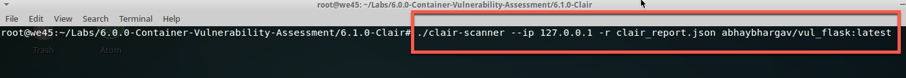

# Clair

---

##### Step1:

* Open terminal


##### Step2:

* Run `cd /home/we45/container_training/Container/Container-Vulnerability-Assessment/Clair` into Clair Lab Folder

    ```commandline
    root@we45:~# cd /home/we45/container_training/Container/Container-Vulnerability-Assessment/Clair
    root@we45:container_training/Container/Container-Vulnerability-Assessment/Clair#
    ```

##### Step3:

* Run clair related docker containers

    * `docker run -d -p 5432:5432 --name db arminc/clair-db:2017-09-18`
    
    ```commandline
     root@we45:container_training/Container/Container-Vulnerability-Assessment/Clair# docker run -d -p 5432:5432 --name db arminc/clair-db:2017-09-18
     e4cc159b0a71400ef6e57b4b2e5207b44bc4ceda630c27c551026a197b7f7414
    ```
    
    * `docker run -d -p 6060:6060 --link db:postgres --name clair arminc/clair-local-scan:v2.0.1`
    
    ```commandline
    root@we45:container_training/Container/Container-Vulnerability-Assessment/Clair# docker run -d -p 6060:6060 --link db:postgres --name clair arminc/clair-local-scan:v2.0.1
    4e3e38be1f84ff757836ea1cf34184d160b90a9a63ee236b7134d2a842a74f58
    ```
  
##### Step4:

* Run Clair Scan 
    * `./clair-scanner --ip <VM_IP> -r clair_report.json abhaybhargav/vul_flask:latest`
    
    
##### Step5: 

* Run `clean-docker` to stop all clair related container.  

    ```commandline
    (venv)root@we45: clean-docker
    92200af86b18
    ca94dab2d52e
    92200af86b18
    34c4adcf326d
    86cd73d03ef1
    ca94dab2d52e
    "docker rmi" requires at least 1 argument.
    See 'docker rmi --help'.
    
    Usage:  docker rmi [OPTIONS] IMAGE [IMAGE...]
    
    Remove one or more images
    
    ```