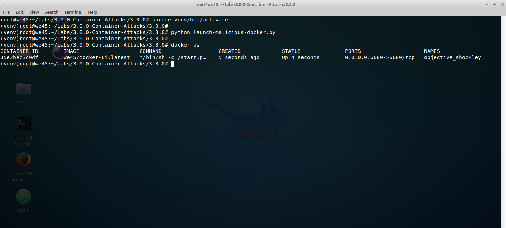
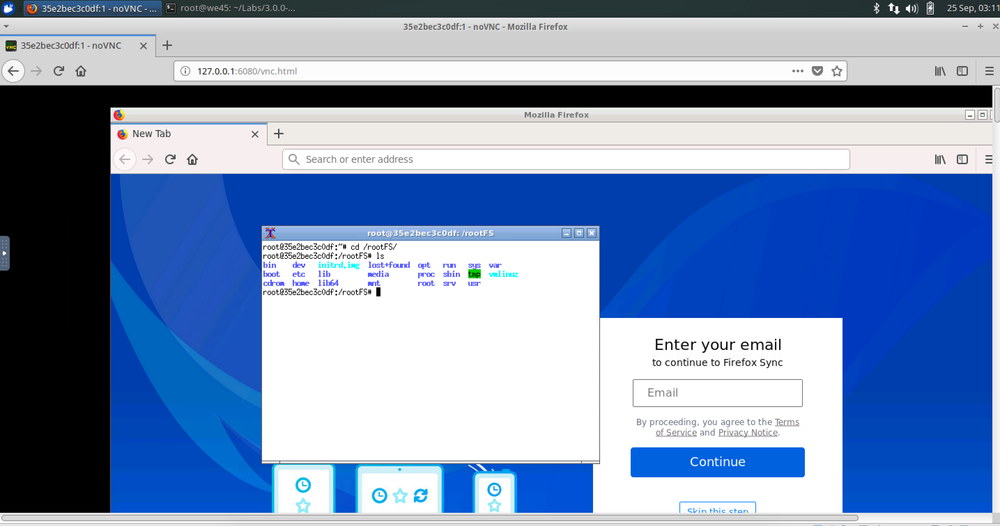

# **`Docker Daemon Configuration`**

###### A malicious user who gains access Docker API, can launch a container and gain access to the host machine with root permissions.

### Enable Docker API

* Run the following commands

```bash
sed -i '/ExecStart/c\ExecStart=/usr/bin/dockerd -H fd:// -H tcp://0.0.0.0:4243' /lib/systemd/system/docker.service

systemctl daemon-reload

service docker restart

```

##### Step 1:

* Run an nmap scan on the VM to get the list of ports that are open. `nmap 127.0.0.1 -sV -p 4243`


##### Step 2: 

* To verify access to docker API, access `http://<SERVER-IP>:4243/version` and `http://<SERVER-IP>:4243/images/json` from the browser.
 

###### A user can get the list of docker images and docker containers running on that machine

##### Step 3

* Navigate to the directory containing the malicious script.

    ```commandline
    cd /root/labs/container_training/Container/Docker-Daemon-Configuration
    ```

* Create and Activate the python virtual environment and run the script that will launch a malicious container via. the docker API.

```commandline
apt install -y virtualenv && export LC_ALL="en_US.UTF-8" && export LC_CTYPE="en_US.UTF-8"

virtualenv venv

source venv/bin/activate

pip install -r requirements.txt
```
    
```commandline
python launch-malicious-docker.py
```




##### Step 4

* On the browser, access the Server-IP and Port. `http://<SERVER-IP>:6080/vnc.html`


##### Step 5

* `Right-Click` and open the terminal. The user has UI access to the Host machine. 




##### Stop all running docker containers

* Run `clean-docker` to stop all the containers and `deactivate` to exit from the virtual-environment

```commandline
root@we45:~$ clean-docker
```


