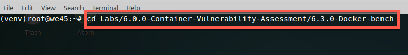

## Dockerbench

###### Docker-bench checks for common best-practices inspired from Docker-CIS-Benchmark when deploying docker containers in production. (https://benchmarks.cisecurity.org/tools2/docker/CIS_Docker_Community_Edition_Benchmark_v1.1.0.pdf) 


##### Step 1:

* Open terminal


##### Step 2:

* Navigate to Docker-bench Lab Folder

```commandline
cd /home/we45/container_training/Container/Container-Vulnerability-Assessment/Docker-bench
```




##### Step 3:

* Run docker bench command

```commandline
docker run -it --net host --pid host --userns host --cap-add audit_control -e DOCKER_CONTENT_TRUST=$DOCKER_CONTENT_TRUST -v /var/lib:/var/lib -v /var/run/docker.sock:/var/run/docker.sock -v /usr/lib/systemd:/usr/lib/systemd -v /etc:/etc --label docker_bench_security docker/docker-bench-security
```


##### Stop all running docker containers

* Run `clean-docker` to stop all the containers

```commandline
root@we45:~$ clean-docker
```
