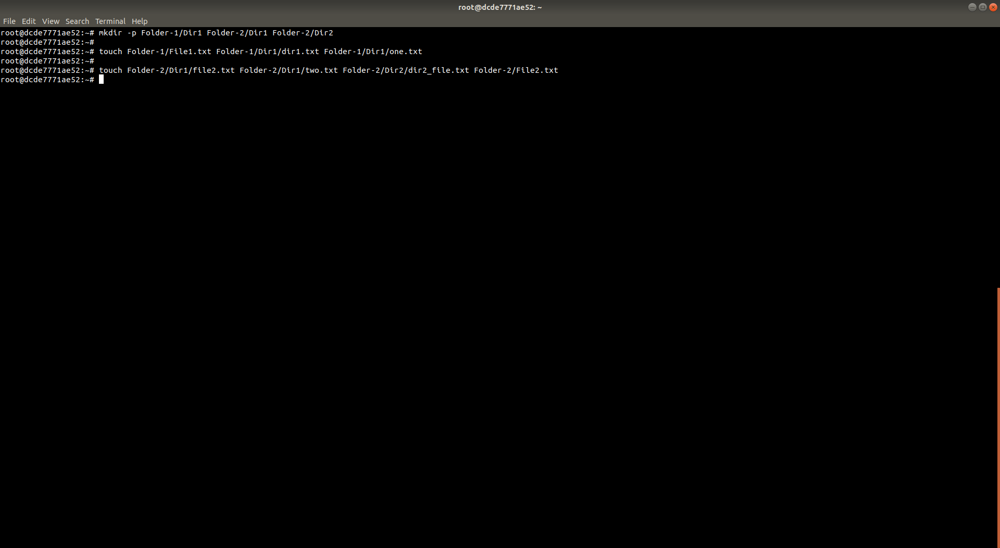

# Union Mount FileSystem


##### Step 1: 

* Install union-fs 

```bash
apt install unionfs-fuse tree
```

* Create Three Folders named `Folder-1`,  `Folder-2` and `mnt`

```bash
mkdir Folder-1 Folder-2 mnt
```


##### Step 2: 

* Create sub-directories and files in `Folder-1` and `Folder-2`

```bash
mkdir -p Folder-1/Dir1 Folder-2/Dir1 Folder-2/Dir2

touch Folder-1/File1.txt Folder-1/Dir1/dir1.txt Folder-1/Dir1/one.txt

touch Folder-2/Dir1/file2.txt Folder-2/Dir1/two.txt Folder-2/Dir2/dir2_file.txt Folder-2/File2.txt
```




##### Step 3: 

* Check the structure of directories that have been created

```bash
tree .
```


##### Step 4: 

* Run `unionfs-fuse -o dirs=Folder-1:Folder-2  mnt/` . The directories and files in `Folder-1` and `Folder-2` will be mounted on `mnt`

```bash
unionfs-fuse -o dirs=Folder-1:Folder-2  mnt/
```


##### Step 5: 

* Check the structure of `mnt/` 

```bash
tree mnt
```


##### Step 6: 

* To unmount, run `umount -l mnt`

```bash
umount -l mnt
```


##### Step 7:

* Remove the directories sub-directories and files created

```bash
rm -rf Folder-1 Folder-2 mnt
```
