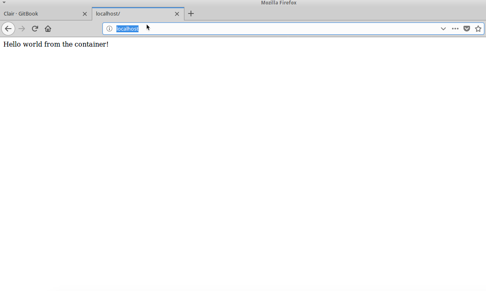

## Docker-Compose

###### Docker-compose is a tool used to run multi-container applications/services on a single host. The multi-container configuration setting can be done using a yaml file where requirements to deploy a service can be specified. Multiple container can be launched using a single command with help of the `docker-compose.yml` file. (https://docs.docker.com/compose/overview/)


##### Step 1:

* Open terminal


##### Step 2:

* Navigate to the Docker compose Lab Folder by running `cd /home/we45/container_training/Container/Container-Orchestrators/Docker-Compose`
    
    ```commandline
    root@we45:~# cd /home/we45/container_training/Container/Container-Orchestrators/Docker-Composeroot@we45:~/container_training/Container/Container-Orchestrators/Docker-Compose#
    ```


##### Step 3:

* Run `docker-compose up -d` to launch all the containers mentioned in `docker-compose.yml` file.

    ```commandline
    root@we45:~/container_training/Container/Container-Orchestrators/Docker-Compose# docker-compose up -d
    Creating network "docker-compose_default" with the default driver
    Creating docker-compose_helloworld_1 ... done
    Creating docker-compose_nginx_1      ... done
    ```


##### Step 4:

* Open Browser and go to `http://localhost` to check the application status 




##### Step 5:

* Run `docker-compose down` to stop all running containers.


##### Stop all running docker containers

* Run `clean-docker` to stop all the containers

```commandline
root@we45:~$ clean-docker
```

