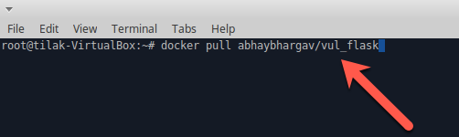
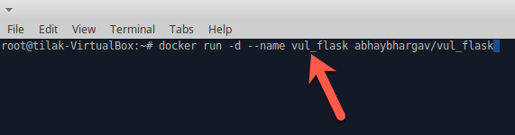
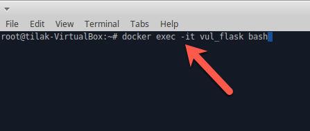

##Docker Hands-On Part-1 

* Open terminal

* Download docker image from Docker Hub
    * `docker pull abhaybhargav/vul_flask`
    
    
    
* View list of docker images
    * `docker pull abhaybhargav/vul_flask`
    
    
    
 
* Start docker container 
   * `docker run -d --name vul_flask abhaybhargav/vul_flask`
    
   
    
* List of running containers
   * `docker ps`
    
   
    
    
* Exec into a container
   * `docker exec -it vul_flask bash`
    
   
   

* Exit from the container
   * `exit`
    
    
   
* List of running containers
   * `docker ps`
    
   
   
   
* Stop running container
   * `docker stop vul_flask`
    
      
    

* List of all containers including stopped and running containers
   * `docker ps -a`
    
   
   
* Remove Stopped container
   * `docker rm vul_flask`
    
   

* Remove docker image
   * `docker rmi abhaybhargav/vul_flask`
    
   
