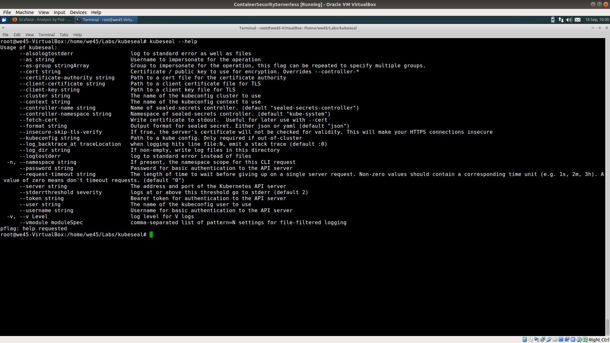
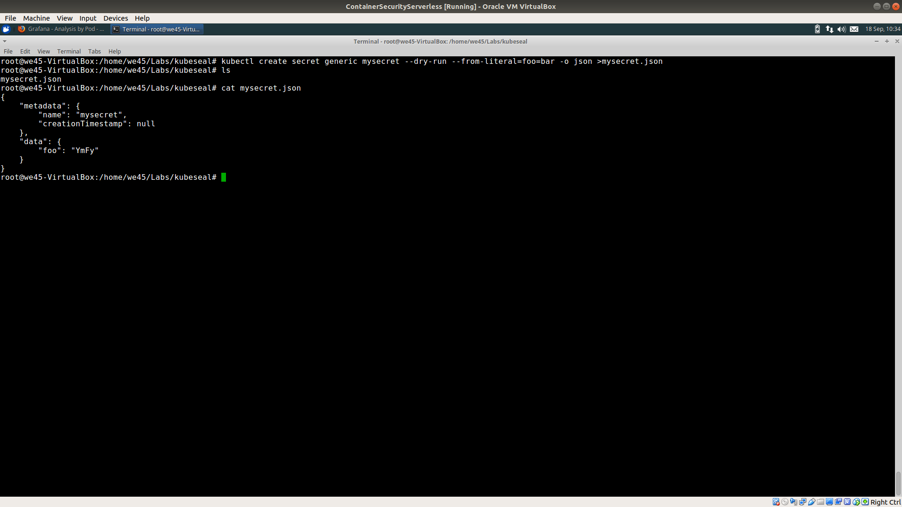
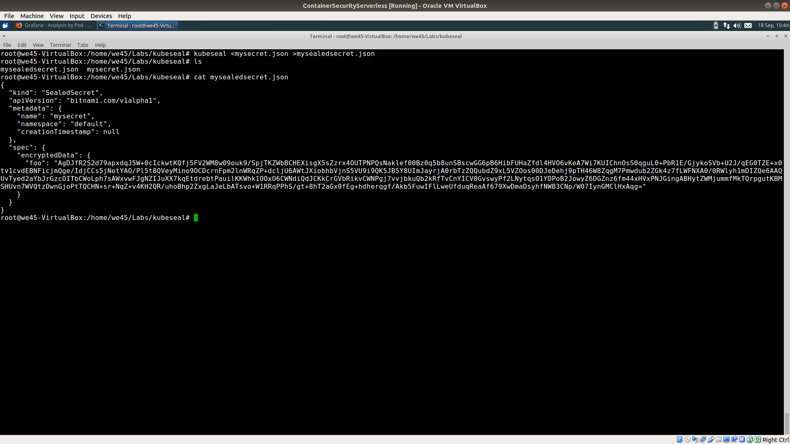
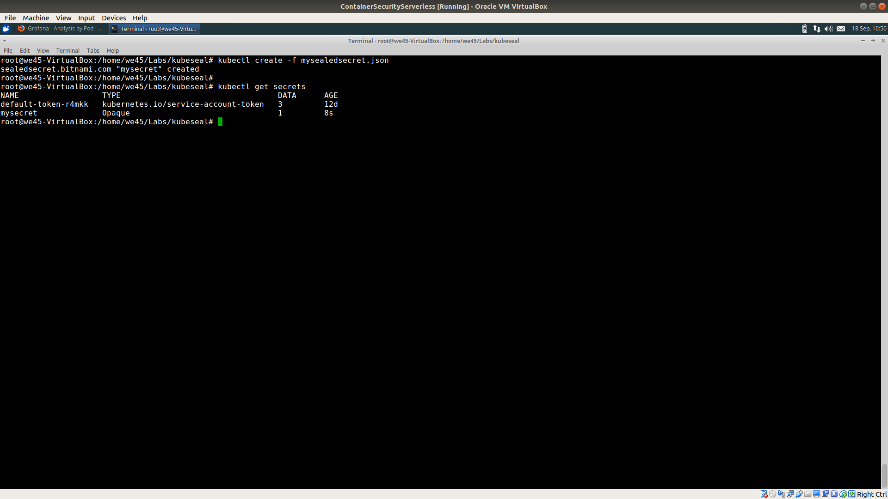

# **`Sealed Secrets for K8s`**

Step 1: Run `kubeseal --help` to get the list of options for usage

Step 2: Create a k8s secret file named `mysecret.json` by running `kubectl create secret generic mysecret --dry-run --from-literal=foo=bar -o json >mysecret.json

Step 3: Seal the secret using kubeseal by running `kubeseal <mysecret.json >mysealedsecret.json` to create mysealedsecret.json

Step 4: Create a k8s secret object using the sealed secret by running `kubectl create -f mysealedsecret.json` and then run `kubectl get secrets` to verify

