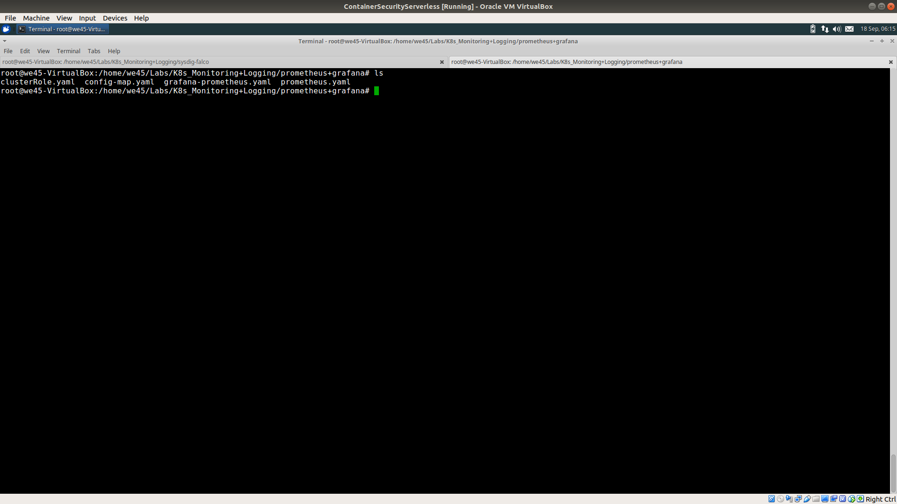
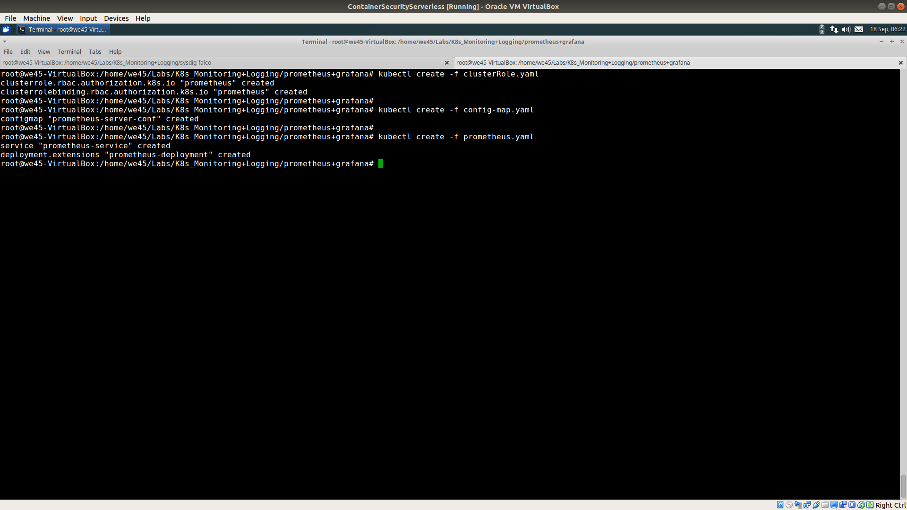
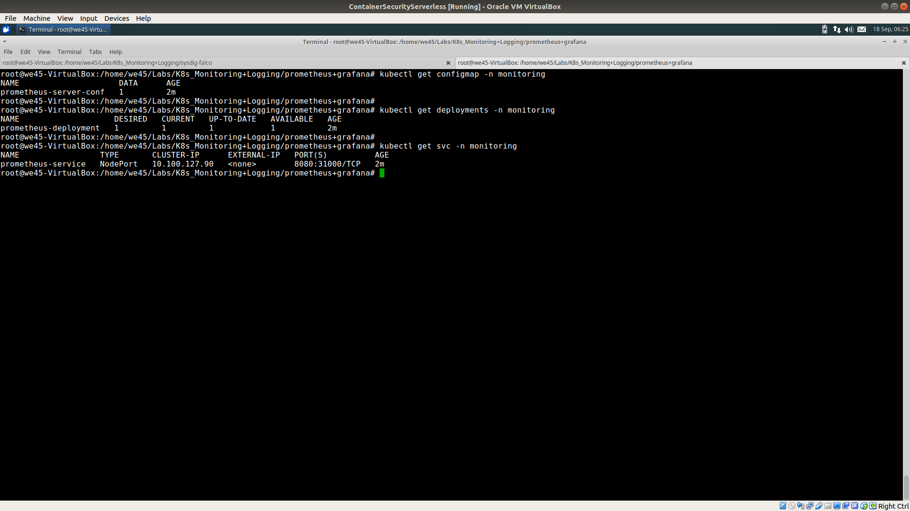
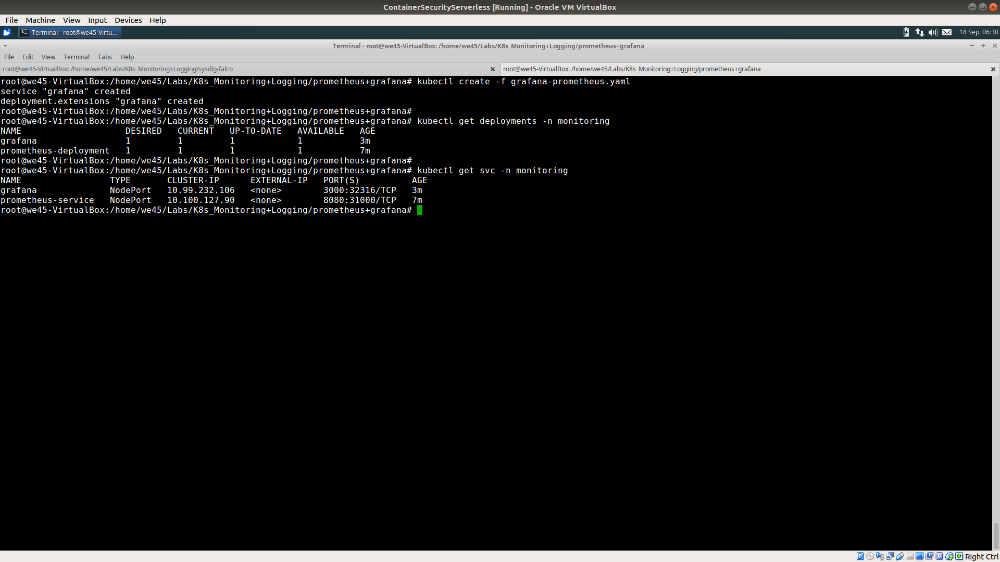
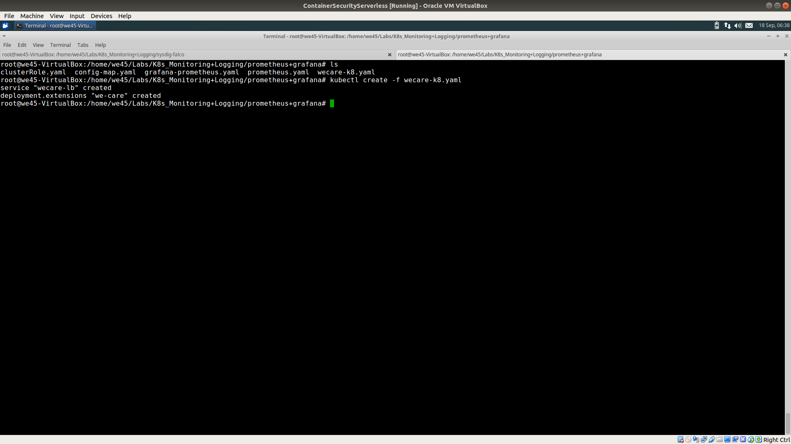
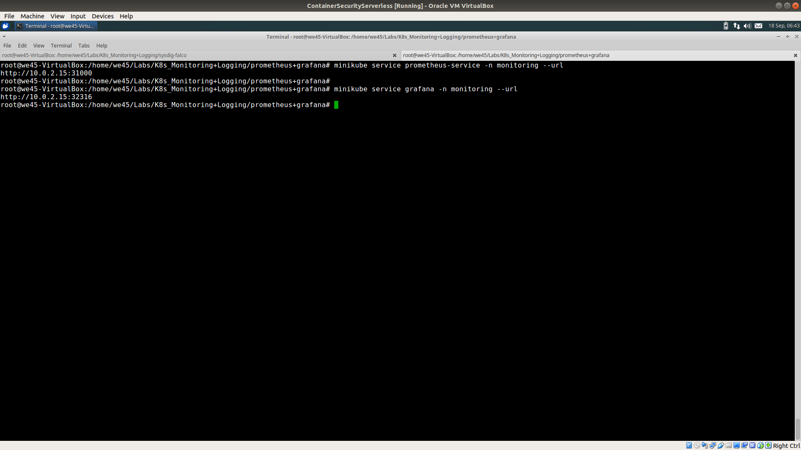
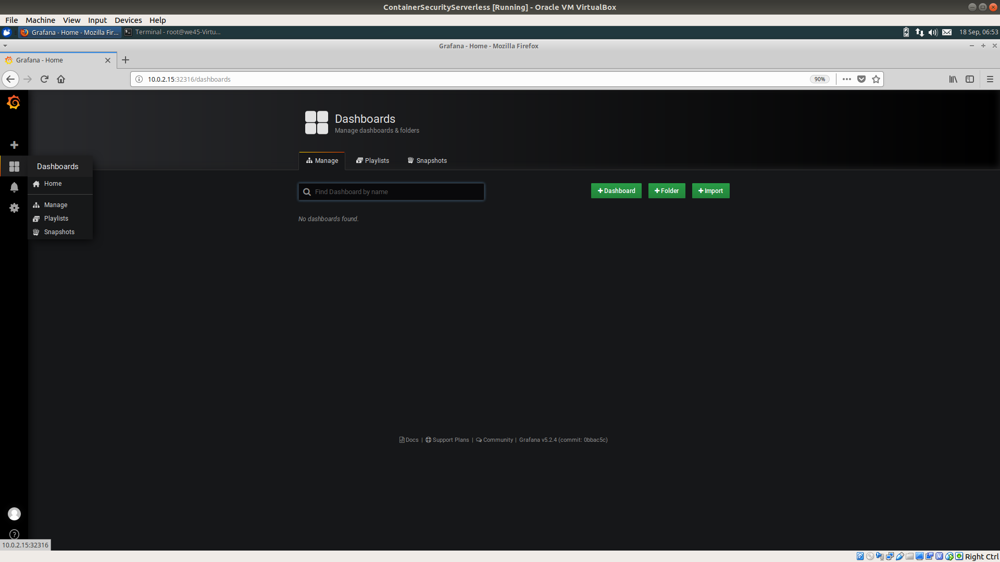
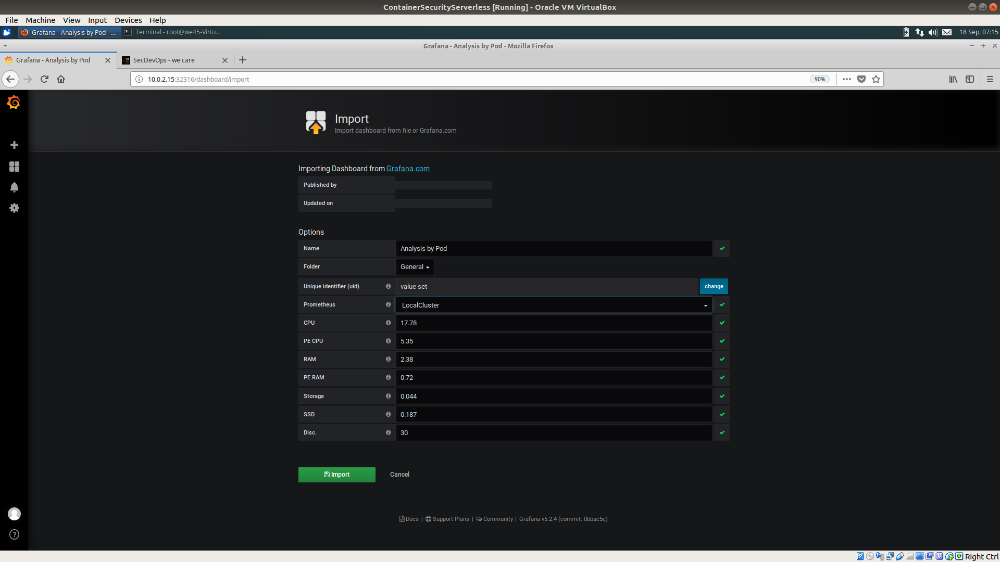
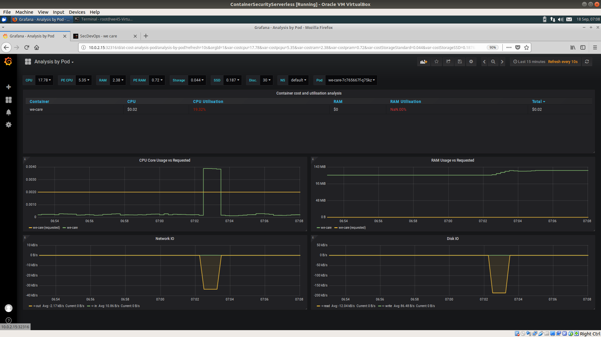

# **`Monitoring - prometheus-grafana`**

Step 1: Navigate to prometheus+grafana directory

Step 2: Create a seperate K8s namespace named 'monitoring' by running `kubectl create namespace monitoring` and then run `kubectl get ns` to verify

Step 3: Create ClusterRole, ConfigMap, prometheus service and deployment bu running:
    
    kubectl create -f  clusterRole.yaml
    
    kubectl create -f config-map.yaml
    
    kubectl create -f prometheus.yaml

    

Step 4: Verify by running
    
    kubectl get configmap -n monitoring
    
    kubectl get deployments -n monitoring
    
    kubectl get svc -n monitoring

Step 5: Launch grafana by running `kubectl create -f grafana-prometheus.yaml` and verify by running `kubectl get deployments -n monitoring` and `kubectl get svc -n monitoring`

Step 6: Launch an application by running `kubectl create -f wecare-k8.yaml`

Step 7: Get Prometheus & Grafana urls by running `minikube service prometheus-service -n monitoring --url` and `minikube service prometheus-service -n monitoring --url`

Step 8: Access Grafana on the browser using the url and login using the credentials, `admin/admin` and temporarily skip the change password prompt.

Step 9: Clicking on `Add data source`, should redirect to a new page. Select `Prometheus` as the Type from the drop down Menu and fill the prometheus URL found in Step 7. Save and Test to add Data souce once the Form is filled

Step 10: On the Dashboards Tab on the Left, click on manage. 

Step 11: Click on the Upload button to upload `kubernetes-pod-monitoring.json` file and click on Load

Step 12: Change name if necessary, Select LocalCluster(name given in Step 9) as Prometheus data source and import

Step 13: Dashboard with resouce usage statistics should show up. It is possible to select Namespace and Pod from the drop down as well.

