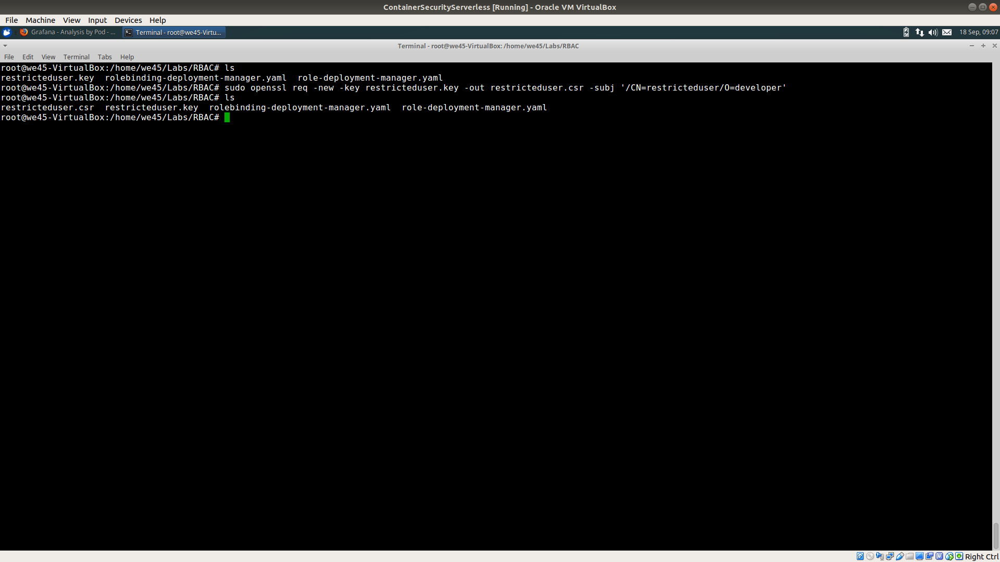

# **`Role Based Access Control`**

Step 1: Generate an ssl key by running `sudo openssl genrsa -out restricteduser.key 4096`

Step 2: Generate a certificate using the key created in Step 1 by running `sudo openssl req -new -key restricteduser.key -out restricteduser.csr -subj '/CN=restricteduser/O=developer'`

Step 3: Generate a self-signed key for minikube by running `sudo openssl x509 -req -in restricteduser.csr -CA ~/.minikube/ca.crt -CAkey ~/.minikube/ca.key -CAcreateserial -out restricteduser.crt -days 365`

Step 4: Create a namespace by running `sudo kubectl create namespace restricted-namespace`

Step 5: Set credentials and context for the user `restricteduser` by running
    
    kubectl config set-credentials restricteduser --client-certificate=restricteduser.crt  --client-key=restricteduser.key
    
    kubectl config set-context restricteduser-context --cluster=minikube --namespace=restricted-namespace --user=restricteduser

Step 6: Try fetching the list of pods with restricteduser-context by running `kubectl --context=restricteduser-context get pods`

Step 7: Create a Role and RoleBinding in restricted-namespace by running 
    
    kubectl -n restricted-namespace create -f role-deployment-manager.yaml
    kubectl -n restricted-namespace create -f rolebinding-deployment-manager.yaml

Step 8: Run a pod using restricteduser-context `kubectl --context=restricteduser-context run --image nginx:alpine nginx`

Step 9: Using the restricteduser-context, try deleting the pod by running 

    kubectl --context=restricteduser-context get pods 
    
    kubectl --context=restricteduser-context delete pod <pod_name> 

