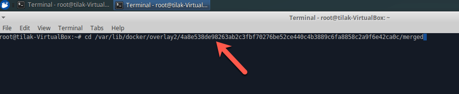
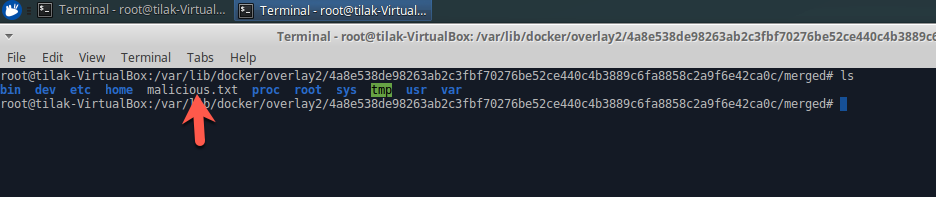
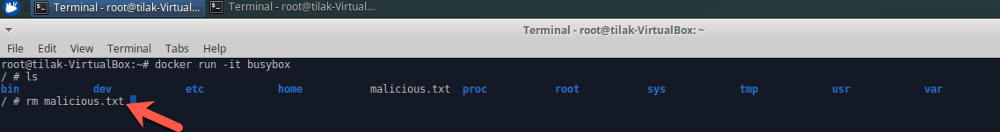

##Mount Namespace Isolation
* Open terminal

* Run docker image (docker run -it busybox)

* Type **ls** command in the terminal

* Open New Terminal in the host system

* Type **findmnt** command in the terminal

* Copy the docker overlay path

* Type **cd** and paste the docker overlay path

 

* Type **ls** command in the terminal

* Create file using touch command (touch malicious.txt) in the host system terminal

* Type **ls** command in the terminal

* Now Open Docker exec terminal and type **ls**

* Delete malicious.txt file inside docker exec

* Type **ls** command in the terminal

* Open host terminal and type **ls** inside docker overlay path

