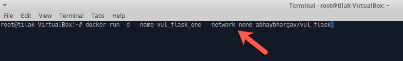
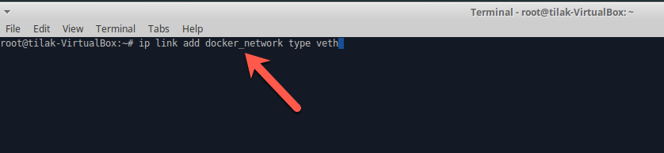
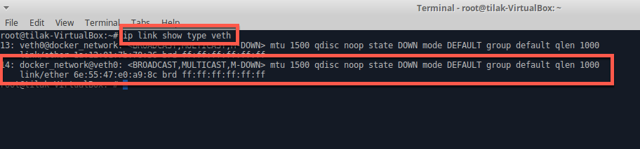
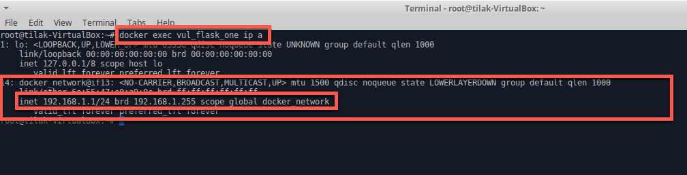

##Network Namespace 

* Open terminal

    

* Run docker container without network 
    * `docker run -d --name vul_flask_one --network none abhaybhargav/vul_flask`
    
    
 
* Docker exec into the container

    * ``docker exec vul_flask_one ip a``
    
    
   
* Create Network Namespace directory for docker network

    * ``mkdir /var/run/netns``
    
    
    
* Create Separate Network for docker
    * ``ip link add docker_network type veth
``

    
    
    
* Show All veth networks
    ``ip link show type veth``
    
    

* Get docker container PID
    * ``pid_one="$(docker inspect --format '{{.State.Pid}}' vul_flask_one)"
``
    
    
    
* Assigning created network namespace into container using symlink
    * ``ln -s /proc/$pid_one/ns/net /var/run/netns/vul_flask_one``
    
    
    

* Add created docker_network (veth) into docker container
    * ``ip link set docker_network netns vul_flask_one
``
    
    
    
    
* Assign IP into the docker container via docker_network (veth)
    * ``ip netns exec vul_flask_one ifconfig docker_network 192.168.1.1/24``
    
    
    
 * Check IP asiigned it into docker container
    * ``docker exec vul_flask_one ip a``
    
     
     
 
 * Ping from the Host system
    * ``ping 192.168.1.1``
    
    
 
 
     