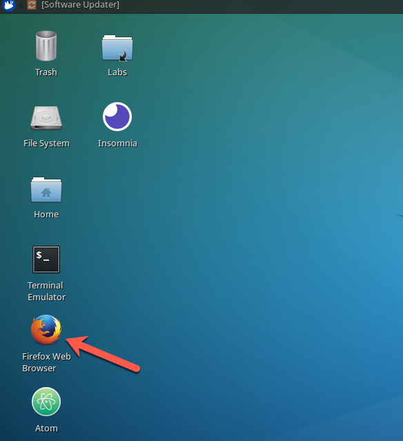
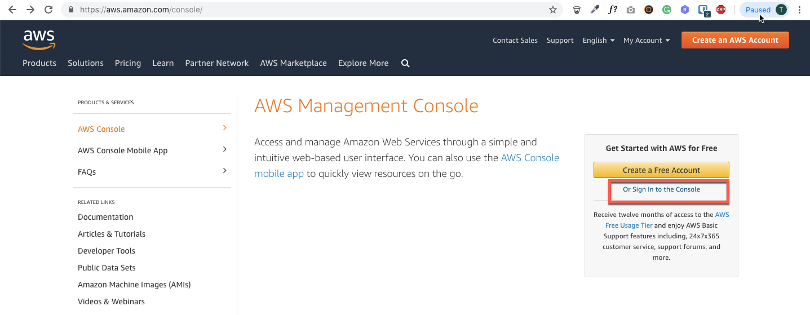
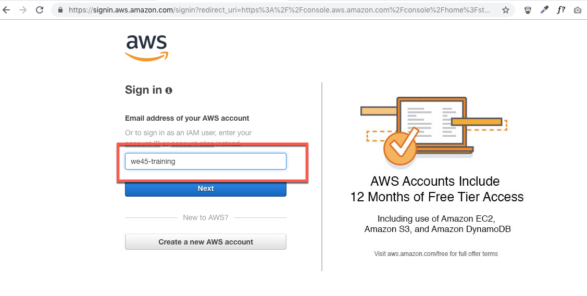
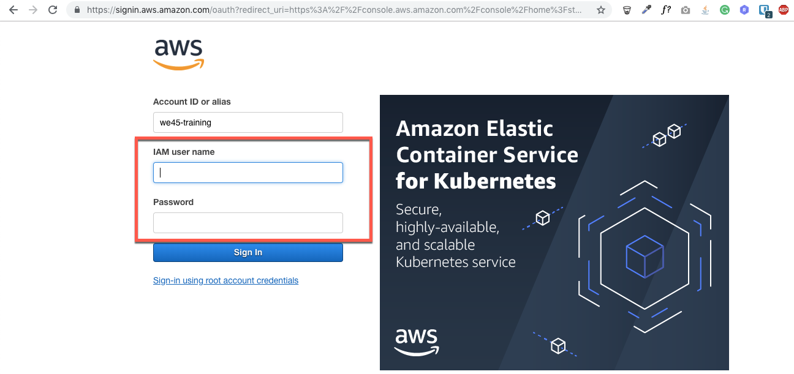
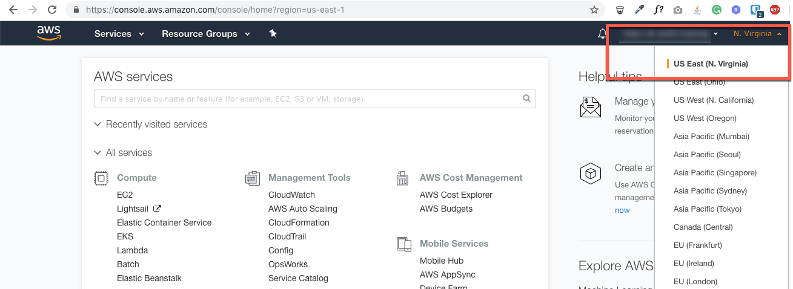

## AWS Console Login

##### Step 1:

* Open Browser

##### Step 2:

* Paste the following URL

`https://aws.amazon.com/console/`

##### Step 3:

* Enter `we45-training` as AWS account ID and then click Next button

##### Step 4:

* Enter your credentials, that have been given to you.

##### Step 5:

* Once logged into the AWS console please select the region `US East (N Virginia)`

