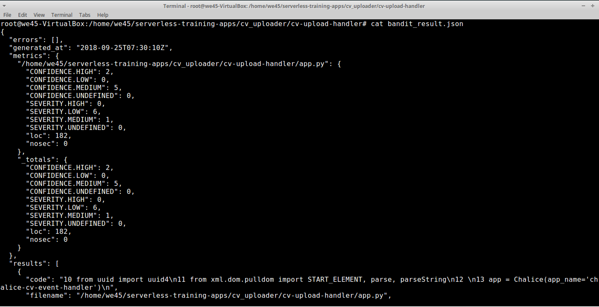

# **`Bandit - Python Static-Application-Security-Testing`**

Step 1: Navigate to the directory(`/root/labs/`) that has the project to be scanned

Step 2: Run `bandit -r -f json -o bandit_result.json DVFaaS-Damn-Vulnerable-Functions-as-a-Service/` to run a bandit scan and generate a `json` report.

Step 3: The report is generated and can be read

