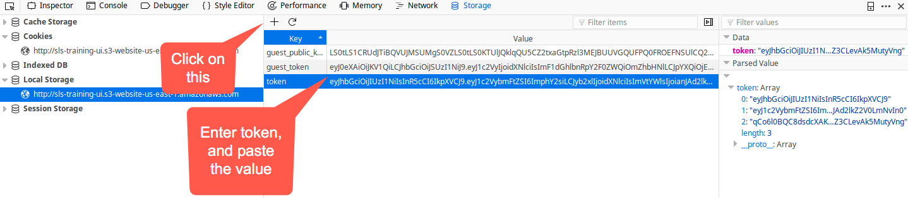

## None-Unique Values

##### Step 1:

* Open browser

##### Step 2:

* open `http://sls-training-ui.s3-website-us-east-1.amazonaws.com/` to access the XML-Uploader application.

##### Step 3:

* Click `Shift + f9` or right click on top of the browser and click on `Web Developer` to select the `Storage Inspect` tab.

##### Step 4:

* Copy the `token` of user 'jack'

##### Step 5:

* Click on `protected` icon.

##### Step 6:

* User deleted from the application.

##### Step 7:

* Register new user with same username

##### Step 8:

* Once the user registered don't login

##### Step 9:

* Click `Shift + f9` or right click on top of the browser and click on `Web Developer` to select the `Storage Inspect` tab.

##### Step 10:

* Paste the `token` you copied

##### Step 11:
 
* Once `token` is pasted , access the URL `http://sls-training-ui.s3-website-us-east-1.amazonaws.com/protected`

