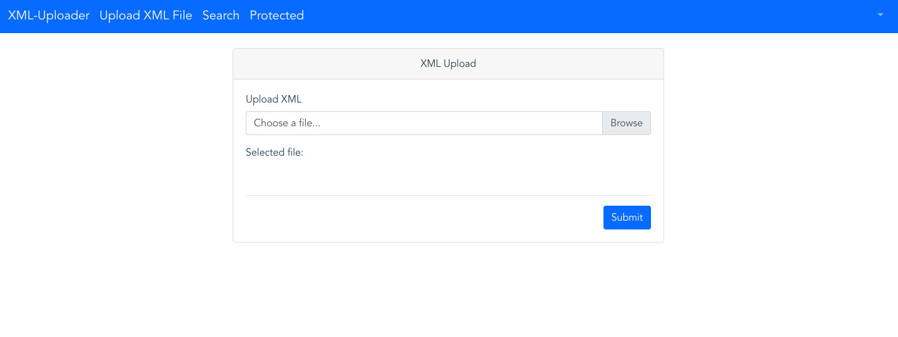

## Event Injection S3

##### Step 1:
* Open browser

##### Step 2:

* open `http://sls-training-ui.s3-website-us-east-1.amazonaws.com/` to access the XML-Uploader application.

##### Step 3:

* Click Register icon to register on the application

    **Note:** Please enter required information and submit.

    

##### Step 4:

* Using `email` and `password` login to the application.

##### Step 5:

* Once Logged in, click `Upload File` icon

##### Step 6:

* Upload-XML file view

**Note:** Please upload a malicious XML file

##### Step 7:

* Once the file has been uploaded, It will redirect to `/home/` .

**Note:** Here will see all our uploaded Xml files. Please refresh the page if the file is not visible.

##### Step 8:

* Click the file name on the left .

##### Step 9:

* You will see that the exploitation has been successful.

