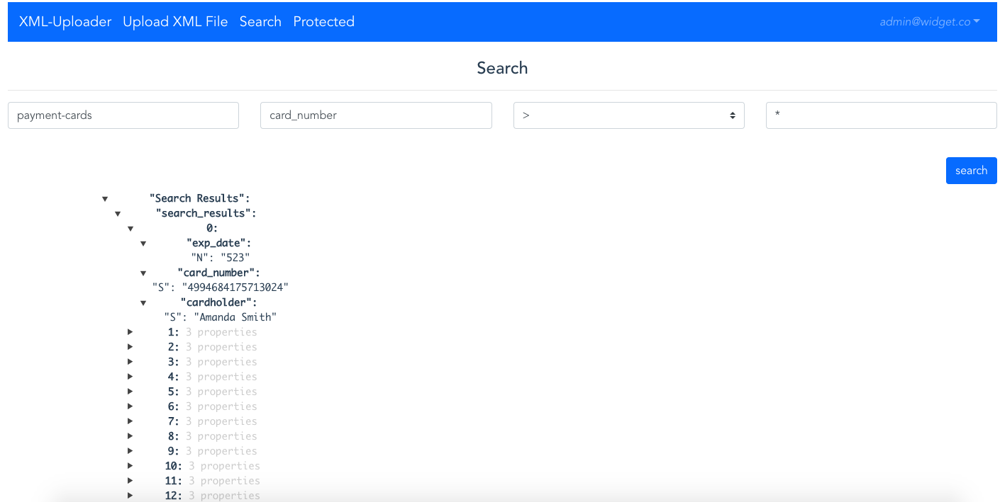

## Exploit based on IAM Permission Flaw

##### Step 1:

* Open browser

##### Step 2:

* open `http://sls-training-ui.s3-website-us-east-1.amazonaws.com/` to access the XML-Uploader application.

##### Step 3:

* Click on `Search` icon to search for information.

##### Step 4:

* In the search functionality, enter a payload and search.

##### Step 5:

* You will see all the information present in the database.

