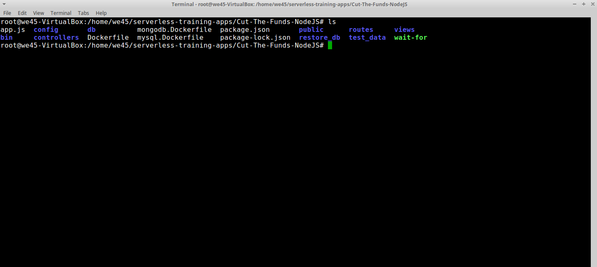

# **`NPM-Audit - NodeJS Source-Code-Analysis-Tool`**

Step 1: Navigate to the directory(`~/Cut-The-Funds-NodeJS`) that has the source code to be scanned.

Step 2: Run `npm audit --json >> npm_audit.json` to scan and generate a json report. The report generated can be read.

